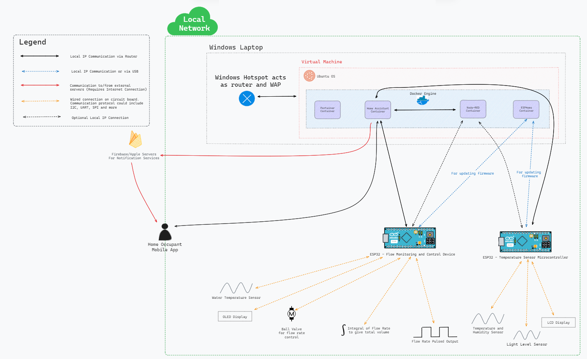
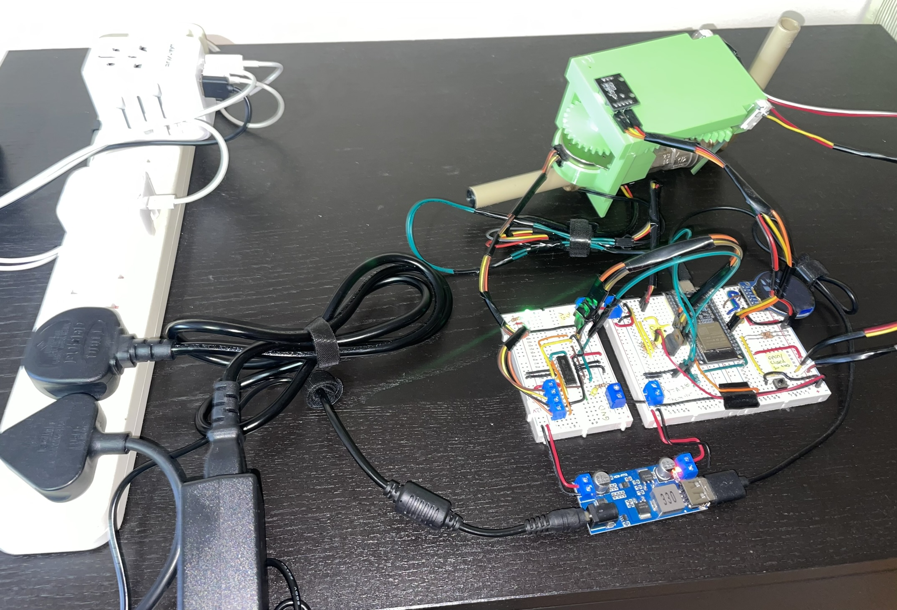
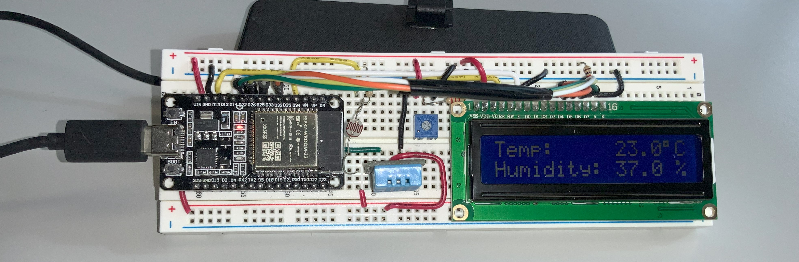

# Smart Home Water Flow Sensing and Control using ESPHome and Home Assistant

This was my final year project for my BEng in Mechatronics Engineering.

The project aimed to create a smart water flow sensing and control system integrated into [Home Assistant](https://www.home-assistant.io/). I chose this because I love Home Assistant and enjoy creating devices & software automations in my home. The aim was to keep everything within the local network, as that is the aim of Home Assistant. This also helped in reducing latency for actions, allowing devices to work in a more "real-time" fashion.

It consisted of two ESP32 based devices programmed using [ESPHome](https://esphome.io/):

1. Water flow sensor & control via a motorised ball valve
2. Temperature sensor

Both were IP connected and were integrated into Home Assistant which ran along side Node-RED in a docker container. The containers were managed using Portainer. For the sake of the project, these ran on a VM on my laptop, and the ESP32 devices connected to my laptops hotspot. Hence this mimicked a home network setup.

The ESPHome configurations for the devices are in the `esphome` directory:

- [`fyp-temp-sensor.yaml`](esphome/fyp-temp-sensor.yaml) - Configuration for the temperature sensor
- [`fyp-water-control.yaml`](esphome/fyp-water-control.yaml) - Configuration for the water flow sensor and control

## Architecture

The overall architecture of the system is shown below:

## Devices

### Water Flow Sensor and Control

The water flow sensor and control device is shown below:

### Temperature Sensor

The temperature sensor is shown below:

## Results

In the end, the system was configured to work in two ways:

1. The water control device acted as a smart TRV, and the hot water flow (ie how much the ball valve was open) was controlled by the temperature setpoint defined in Home Assistant. The temperature sensor was used to measure the temperature in the room. This setup implemented a PID controller and based on measurements of the device & average room values in Ireland, the system was simulated to see how a room could be heated using this setup. The simulation was done in an [Excel file](https://docs.google.com/spreadsheets/d/1R-e4HWdBuG948Ufl9aNrg3_9wH5RYTUA/edit?usp=sharing&ouid=111026779034388612254&rtpof=true&sd=true), and the graphs (see [pid_simulations](./pid_simulations)) show how the temperature in a room would change based on the initial temperature, outside temperature & heat loss of the room.

2. The water control device was used as a smart water meter for a home. The flow rate was measured and displayed on the LCD screen. The data from this could be used to calculate & predict usage and also alert the user if there was a leak.

The devices all communicated via Home Assistant. Node-RED was used to do any heavier processing/integrations.

See the [media](./media) directory for more images.
